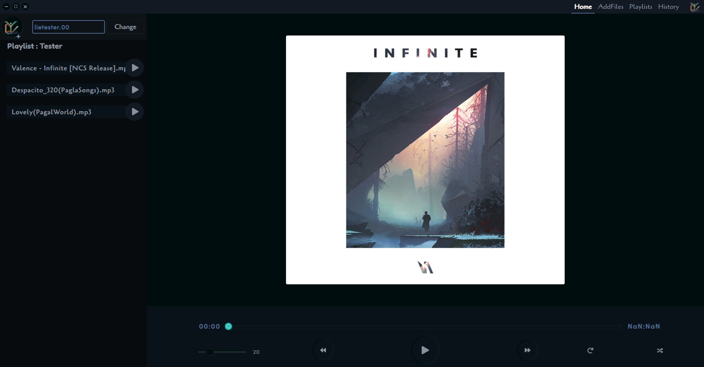

<h2 align="center">
<a href="https://drive.google.com/file/d/1ihD8RPjMB6Iz3auskRE4LQ5ELV8zu2Ct/view?usp=sharing">Concord - (Music Player)</a>
</h2>



### Minimal-electron-react-boilerplate ( extended verion of [Alex Devero](https://github.com/alexdevero) by [Sanan4li](https://github.com/Sanan4li) )

### Install

#### Clone this repo

```
git clone https://github.com/lieTester/Concord.git
```

#### Install dependencies

```
npm install
or
yarn install
```

### Usage

#### Run the app

```
npm start
or
yarn start
```

#### Build Dist-Folder

```
npm run build
```
